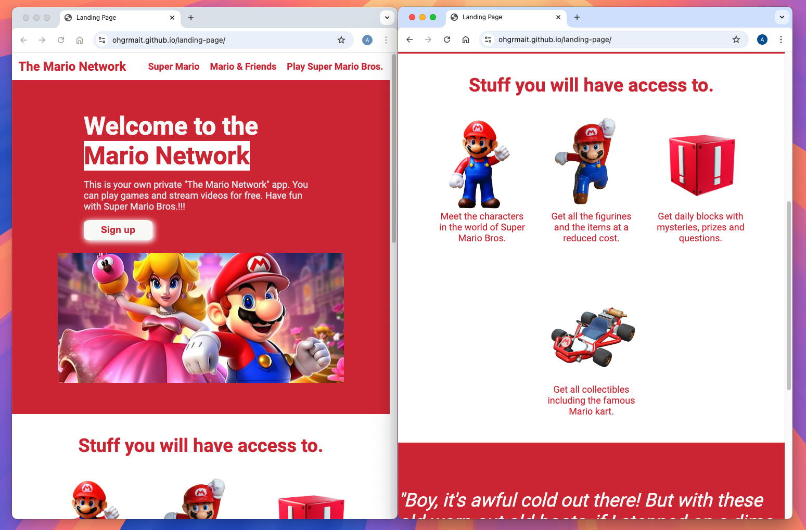
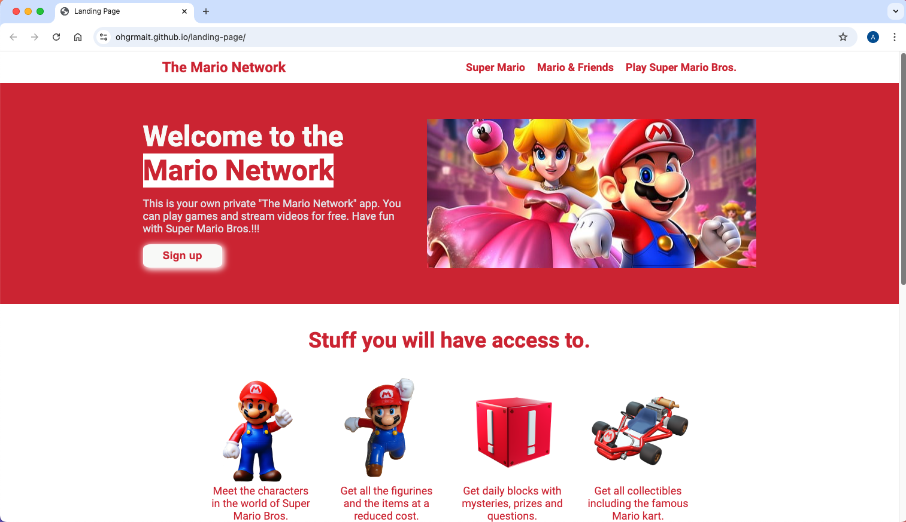
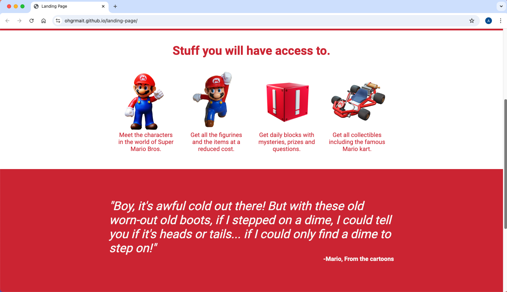
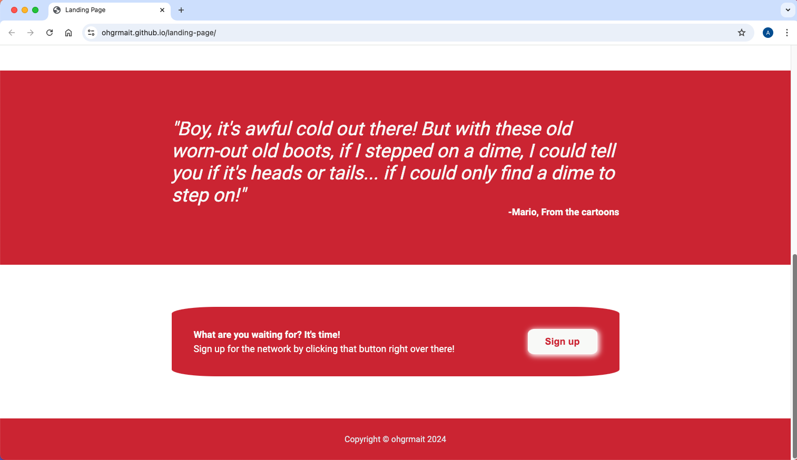

  <h1>Landing Page</h1>

  An Entire Web Page from a Design built using HTML and CSS ([live preview](https://ohgrmait.github.io/landing-page/))

  

## About

This project shows a "**mario-themed**" landing page which was initially designed to create an entire web page from two design images (as per project specifications) but later on stylized to provide a unique personal touch based on the famous "Super Mario Bros."[^1]

[^1]: [This project](https://www.theodinproject.com/lessons/foundations-landing-page) is from the [Foundations Course](https://www.theodinproject.com/paths/foundations/courses/foundations) in [The Odin Project](https://www.theodinproject.com/about).

## Showcase

  
  
This is a screenshot of the index page 1.

  
  
This is a screenshot of the index page 2.

  
  
This is a screenshot of the index page 3.

  
  
This is a screen cast of the landing page.

## Technologies
- ***Git***
- ***CLI***
- ***CSS***
- ***HTML***
- ***GitHub***
- ***GitHub Pages***

## Self Reflections
- > I really enjoyed recreating the webpage design and then personalizing it via the "**mario-theme**". After my [previous project](https://github.com/ohgrmait/odin-recipes), the only thing that I added to my arsenal was flexbox, which I absolutely loved doing. I might have gone overboard again but it was pleasant experience to add more than what the project specification asked for. TOP resources (especially the articles) in the flexbox section were a big help.

## Acknowledgements
- Credit for the images:
  - in the header goes to [EvelKnievel](https://pixabay.com/users/evelknievel-14648942/),
  - in others go to [Alexas_Fotos](https://pixabay.com/users/alexas_fotos-686414/), [InspiredImages](https://pixabay.com/users/inspiredimages-57296/), and [Thor_Deichmann](https://pixabay.com/users/thor_deichmann-2306827/).
- Credit for the mario quote goes to the [Mario/quotes](https://nintendo.fandom.com/wiki/Mario/quotes) section in the [Nintendo wiki](https://nintendo.fandom.com/wiki/Nintendo_Wiki).
- Credit for README goes to [ritaly's README cheatsheet](https://github.com/ritaly/README-cheatsheet) and [ArjunSaili1's comment](https://github.com/TheOdinProject/curriculum/discussions/25472#discussioncomment-5889343).

## Contact and Support
- Please do not hesitate to contact me at ***ohgrmait_02945*** on discord for any project queries.
- This project will no longer be worked upon and no further support will be provided for this project.[^2]

[^2]: The [TOP strategy guide](https://dev.to/theodinproject/learning-code-f56) makes it clear to [focus on the point of the assignment](https://dev.to/theodinproject/learning-code-f56#:~:text=Focus%20on%20the%20point%20of%20the%20assignment) and that [foundations isn't a strong portfolio generator](https://dev.to/theodinproject/learning-code-f56#:~:text=Foundations%20isn%E2%80%99t%20a%20strong%20portfolio%20generator), so I won't be wasting anymore time here.